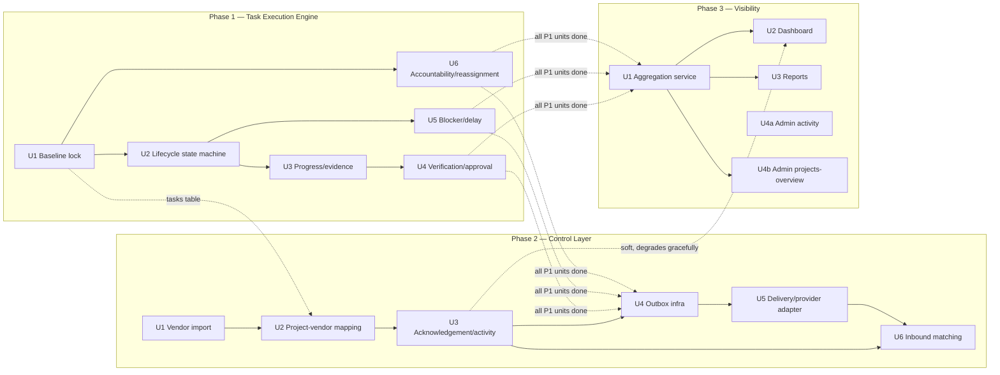

# Parallel Execution Sequencing Across Release 1 Plans

## Summary

This is a coordination document, not a code plan — it defines *when* each already-planned implementation unit can start, based strictly on the `**Dependencies:**` fields already declared in the three approved plans. It answers "can phases run in parallel, and can units within a phase run in parallel" with a concrete stream assignment, not a general yes/no. No new implementation units are introduced here; this document only sequences the 16 units that already exist across the three plans.

---

## Problem Frame

The three plans were written and numbered sequentially (Phase 1 → 2 → 3) because that's how the origin brainstorm doc scoped the *product* rollout, and because Phase 2/3's most consequential units (Phase 2 U4's outbox instrumentation, Phase 3 U1's aggregation) do genuinely require all of Phase 1 to be finished. But "Phase 2 comes after Phase 1" is true for those specific units — it is not true for every unit in Phase 2 and 3, several of which have no real dependency on Phase 1 at all and were sequenced into a later phase purely for product narrative reasons, not technical ones. This document separates the two.

---

## Requirements

- R1. Every unit across the three plans is assigned to exactly one dependency tier, derived only from its own plan's declared `**Dependencies:**` field — no new dependencies are invented here.
- R2. Units with no real dependency on Phase 1 are identified explicitly, even though they live inside a "Phase 2" or "Phase 3" plan document.
- R3. A stream assignment is proposed that keeps as many engineers/agents productively busy as possible without violating any declared dependency.
- R4. The single longest dependency chain (the critical path) is identified, since no amount of parallelism shortens total delivery time below its length.

---

## Scope Boundaries

- This document does not re-plan or re-scope any of the 16 units — it only sequences them. Any change to a unit's actual dependencies must happen by editing that unit's source plan, not this document.
- This document does not assign specific people — "streams" are labeled generically (Stream 1, Stream 2, ...) since team size/composition isn't known here. Map streams to actual engineers/agents at execution time.
- This document does not account for the WhatsApp external-approval timeline's effect on calendar time (Phase 2's Meta/WABA dependency) beyond noting it — that's a Product/Ops-owned date, not a sequencing decision engineering controls.

---

## Context & Research

### Source Data (declared dependencies, verbatim from each plan)

**Phase 1 — `docs/plans/2026-08-02-001-feat-task-execution-engine-plan.md`:**

| Unit | Declared Dependencies |
|---|---|
| U1 Baseline lock | None |
| U2 Task lifecycle state machine | U1 |
| U3 Progress updates/evidence | U1, U2 |
| U4 Verification/approval | U1, U2, U3 |
| U5 Blocker/delay capture | U1, U2 |
| U6 Task accountability/support/reassignment | U1 (independent of U2–U5's internals otherwise) |

**Phase 2 — `docs/plans/2026-08-02-002-feat-control-layer-vendor-whatsapp-plan.md`:**

| Unit | Declared Dependencies |
|---|---|
| U1 V2 vendor tables + legacy import | None (independent of Phase 1) |
| U2 Project-vendor mapping + task delegation | Phase 2 U1, Phase 1 U1 (`tasks` table) |
| U3 Vendor acknowledgement + activity | Phase 2 U2 |
| U4 Outbox infrastructure + mutation hooks | **Phase 1 (all units)**, Phase 2 U2, U3 |
| U5 Message delivery + provider adapter | Phase 2 U4 |
| U6 Inbound message matching | Phase 2 U3, U5 |

**Phase 3 — `docs/plans/2026-08-02-003-feat-visibility-dashboards-reports-plan.md`:**

| Unit | Declared Dependencies |
|---|---|
| U1 Aggregation query service | **Phase 1 (all units)** |
| U2 Dashboard API/frontend | Phase 3 U1; Phase 2 U3 for the vendor-risk widget only (degrades gracefully if absent) |
| U3 Daily/weekly reports | Phase 3 U1 |
| U4a `GET /admin/activity` | **None** — queries the already-existing `V2AuditEvent` table directly |
| U4b `GET /admin/projects-overview` | Phase 3 U1 (and transitively Phase 1) |

Note: U4 was written as one implementation unit in the Phase 3 plan but its two endpoints have genuinely different dependency profiles (this was corrected during that plan's document review) — this document treats them as separately schedulable, U4a and U4b, without altering the source plan's unit structure.

---

## Key Technical Decisions

- **The two Phase 1-wide gates (Phase 2 U4, Phase 3 U1) are real, not conservative padding.** Phase 2 U4 instruments *every* Phase 1 mutation service with an outbox emission call — it cannot be written against services that don't exist yet, and touching all six Phase 1 services after the fact is much riskier than after they've stabilized. Phase 3 U1 aggregates across *all* Phase 1 state (lifecycle status, blockers, delays, verifications, approvals, reassignments) — a partial aggregation service would need to be rewritten once the remaining Phase 1 units land, which is wasted work, not saved time. Both gates are kept as hard "wait for all of Phase 1" points rather than being split into partial-aggregation/partial-instrumentation sub-units, because splitting them would trade a small parallelism gain for guaranteed rework.
- **Everything else is scheduled by its literal declared dependency, not by its phase number.** Phase 2 U1 (vendor import) and Phase 3 U4a (cross-project audit view) have zero technical reason to wait for Phase 1 — they were only "Phase 2" and "Phase 3" in the product narrative sense. This document treats phase numbers as labels, not as a scheduling constraint.
- **Phase 1's U5 and U6 are not on the critical path but do gate Phase 2 U4 / Phase 3 U1.** Because those two units require *all* of Phase 1, finishing the critical chain (U1→U2→U3→U4) early doesn't unlock Phase 2 U4 or Phase 3 U1 if U5/U6 are still open — so U5/U6 should not be treated as low-priority "whenever" work; they should finish at or before the critical chain does, not noticeably after.

---

## Dependency Graph

> Directional guidance for review — this illustrates scheduling order, not a build artifact.

---

## Stream Assignment

Four streams cover all 16 units with no dependency violated. Scale down to 2–3 streams by merging streams in the order listed (Stream 4 merges into Stream 1 first, then Stream 3 into Stream 2) if fewer engineers/agents are available — merging never breaks a dependency because each stream's own internal order is already valid.

### Stream 1 — Critical Path (the pace-setter; nothing else finishes Release 1 faster than this stream does)

1. Phase 1 U1 → U2 → U3 → U4
2. *(wait for Streams 2 and 3 to finish Phase 1 U5/U6 — see Key Technical Decisions)*
3. Phase 2 U4 → U5 → U6
4. Phase 3 U1 → U2 → U3 → U4b

This stream's total length is the minimum possible calendar time for Release 1, regardless of how many other streams exist. Adding more people to *other* streams does not shorten this chain — only reducing the size or difficulty of these specific units does.

### Stream 2 — Phase 1 support work, then Phase 2 vendor bridge

1. Phase 1 U6 (starts as soon as Phase 1 U1 lands — no wait for U2)
2. Phase 1 U5 (starts once Phase 1 U2 lands)
3. *(both must complete before Stream 1 can start Phase 2 U4 — see Key Technical Decisions)*
4. Once free: Phase 2 U1 → U2 → U3 (if Stream 3 hasn't already claimed these)

### Stream 3 — Independent-from-day-one work

1. Phase 2 U1 (vendor import — zero dependency, can start before Phase 1 even begins)
2. Phase 3 U4a (`GET /admin/activity` — zero dependency, can start anytime, including day one)
3. Phase 2 U2 → U3 (once Phase 1 U1 has landed, providing the `tasks` table)

### Stream 4 — Optional, if a 4th engineer/agent is available

- Absorbs whichever of Phase 2 U1/U2/U3 or Phase 3 U4a isn't already claimed by Stream 2/3, so Stream 1's critical-path engineer is never pulled off it to help elsewhere.
- If only 2–3 streams exist, fold this into Stream 2 or 3 rather than leaving it idle.

---

## What Genuinely Cannot Start Early (and why)

- **Phase 2 U4 (outbox infrastructure)** — cannot start meaningfully until all six Phase 1 units exist, because it adds an emission call to each of their services. Starting it against a partial Phase 1 means rewriting it later.
- **Phase 3 U1 (aggregation service)** — same reasoning: it reads from every Phase 1 table; a partial version would need rework once the rest of Phase 1 lands.
- **Phase 2 U6 (inbound message matching)** — needs both U3 (acknowledgement service to call into) and U5 (delivery/dedup infrastructure it reuses for `provider_message_id` uniqueness) — genuinely sequential within Phase 2, not parallelizable.
- **Phase 3 U2/U3** — both need Phase 3 U1's aggregation service; they can run parallel *to each other* once U1 lands (they consume the same summary independently) but not before it.

---

## What Can Start Immediately, Regardless of Everything Else

- **Phase 1 U1** (baseline lock) — the true root of the entire dependency graph; nothing blocks it.
- **Phase 2 U1** (vendor import) — zero technical dependency on anything in Phase 1.
- **Phase 3 U4a** (`GET /admin/activity`) — zero technical dependency on anything; queries a table that already exists today.

If team capacity allows only one stream at project start, these three are the highest-leverage places to look for a second stream to peel off as soon as a second engineer/agent becomes available — none of them require waiting on Phase 1 U1 to land first (except where a stream is already committed to Phase 1 U1 itself).

---

## Risks & Dependencies

| Risk | Mitigation |
|------|------------|
| Streams 2/3 finishing Phase 1 U5/U6 late silently delays Stream 1's Phase 2 U4 start, even though Stream 1's own chain (U1–U4) finished on time | Track Phase 1 U5/U6 completion against Stream 1's U1–U4 chain explicitly, not just against their own stream's pace — they need to finish at the same time, not "eventually" |
| Merging streams (fewer engineers than 4) could tempt someone to skip Phase 1 U5/U6 to focus on the "more important-looking" critical path, silently delaying Phase 2 U4/Phase 3 U1 | Explicitly flagged in Key Technical Decisions and here — U5/U6 are not optional or low-priority despite being off the named "critical path" |
| Phase 2's WhatsApp live-sending timeline (Meta/WABA approval) is not shortened by any amount of engineering parallelism | Out of this document's control by design (see Scope Boundaries) — Product/Ops should start that approval process in parallel with Stream 1/2/3's engineering work from day one, not after Phase 2 U4/U5 land |
| This document could drift from the source plans if any of the three plans' units are later re-scoped or re-ordered | This document derives entirely from the three plans' `**Dependencies:**` fields — if any of those change, re-derive this document rather than hand-editing it out of sync |

---

## Sources & References

- **Origin document:** [docs/brainstorms/release-1-completion-requirements.md](docs/brainstorms/release-1-completion-requirements.md) (§6 first proposed cross-phase parallel streams; this document supersedes that section's estimate with the actual per-unit dependencies now that all three plans exist)
- [docs/plans/2026-08-02-001-feat-task-execution-engine-plan.md](docs/plans/2026-08-02-001-feat-task-execution-engine-plan.md)
- [docs/plans/2026-08-02-002-feat-control-layer-vendor-whatsapp-plan.md](docs/plans/2026-08-02-002-feat-control-layer-vendor-whatsapp-plan.md)
- [docs/plans/2026-08-02-003-feat-visibility-dashboards-reports-plan.md](docs/plans/2026-08-02-003-feat-visibility-dashboards-reports-plan.md)
