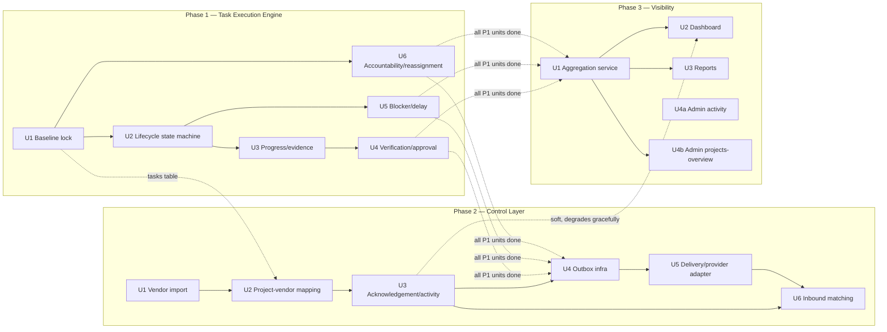

# Parallel Execution Sequencing Across Release 1 Plans

## Summary

This is a coordination document, not a code plan — it defines *when* each already-planned implementation unit can start, based strictly on the `**Dependencies:**` fields already declared in the three approved plans. It answers "can phases run in parallel, and can units within a phase run in parallel" with a concrete stream assignment, not a general yes/no. No new implementation units are introduced here; this document only sequences the 16 units that already exist across the three plans.

---

## Current Status (as of 2026-08-03)

This document was originally written before any unit had shipped, so its Stream Assignment scheduled Phase 1 U1–U4 as the front of the critical path. That has since changed on the ground, on branch `feat/task-execution-engine`:

- **Phase 1 backend — U1 through U6 are all committed** (`7022d42`, `e538f9e`, `035fe7b`, `f6b9520`, `fc6f360`). The "wait for all of Phase 1" gates on Phase 2 U4 and Phase 3 U1 are **satisfied today**, not pending.
- **Phase 1 frontend — none of it was built.** Every unit's plan (U2 through U6) specified a frontend component and API-client function alongside its backend endpoints (`taskExecutionApi.js`, `TaskExecutionBoard.jsx`, `TaskProgressForm.jsx`, `TaskDecisionModal.jsx`, `TaskBlockerDelayPanel.jsx`, `TaskSupportAssignmentPanel.jsx`, `PendingRoleChangesPanel.jsx`, the `ProjectTeamReplaceModal.jsx`/`ProjectDetailModal.jsx` fixes). None exist. `frontend/src/features/execution/ExecutionPage.jsx` still carries its original placeholder comment ("not implemented anywhere in this file"). This is a real, unshipped gap against Phase 1's own Definition of Done, not a documentation lag.
- **Phase 2 and Phase 3 — neither has any code yet** (no `vendor_models.py`, no `project_visibility.py`).
- **New dependency this document missed the first time:** Phase 2 U2's `TaskVendorDelegationForm.jsx` and U3's `VendorAcknowledgementForm.jsx`/`VendorActivityForm.jsx` are specified as rendering *inside* Phase 1 U2's `TaskExecutionBoard` task detail. That component doesn't exist. So while Phase 2's **backend** has zero remaining Phase-1 gate, Phase 2's **frontend** (U2/U3 only) cannot land until the Phase 1 frontend catch-up work below produces `TaskExecutionBoard`. Phase 3's frontend has no equivalent problem — it adds new tabs to the already-existing `ProjectDetailModal.jsx` tab array.

Net effect: the real critical path today is no longer "Phase 1 → Phase 2 → Phase 3." It's a **Phase 1 frontend catch-up track** (small, backend already done, pure UI wiring) running alongside **Phase 2's backend chain** and **Phase 3's backend chain**, which are now both fully unblocked and can run at full parallel speed. See the revised Stream Assignment and the two summary tables below.

---

## Problem Frame

The three plans were written and numbered sequentially (Phase 1 → 2 → 3) because that's how the origin brainstorm doc scoped the *product* rollout, and because Phase 2/3's most consequential units (Phase 2 U4's outbox instrumentation, Phase 3 U1's aggregation) do genuinely require all of Phase 1 to be finished. But "Phase 2 comes after Phase 1" is true for those specific units — it is not true for every unit in Phase 2 and 3, several of which have no real dependency on Phase 1 at all and were sequenced into a later phase purely for product narrative reasons, not technical ones. This document separates the two.

---

## Requirements

- R1. Every unit across the three plans is assigned to exactly one dependency tier, derived only from its own plan's declared `**Dependencies:**` field — no new dependencies are invented here.
- R2. Units with no real dependency on Phase 1 are identified explicitly, even though they live inside a "Phase 2" or "Phase 3" plan document.
- R3. A stream assignment is proposed that keeps as many engineers/agents productively busy as possible without violating any declared dependency.
- R4. The single longest dependency chain (the critical path) is identified, since no amount of parallelism shortens total delivery time below its length.

---

## Scope Boundaries

- This document does not re-plan or re-scope any of the 16 units — it only sequences them. Any change to a unit's actual dependencies must happen by editing that unit's source plan, not this document.
- This document does not assign specific people — "streams" are labeled generically (Stream 1, Stream 2, ...) since team size/composition isn't known here. Map streams to actual engineers/agents at execution time.
- This document does not account for the WhatsApp external-approval timeline's effect on calendar time (Phase 2's Meta/WABA dependency) beyond noting it — that's a Product/Ops-owned date, not a sequencing decision engineering controls.

---

## Context & Research

### Source Data (declared dependencies, verbatim from each plan)

**Phase 1 — `docs/plans/2026-08-02-001-feat-task-execution-engine-plan.md`:**

| Unit | Declared Dependencies |
|---|---|
| U1 Baseline lock | None |
| U2 Task lifecycle state machine | U1 |
| U3 Progress updates/evidence | U1, U2 |
| U4 Verification/approval | U1, U2, U3 |
| U5 Blocker/delay capture | U1, U2 |
| U6 Task accountability/support/reassignment | U1 (independent of U2–U5's internals otherwise) |

**Phase 2 — `docs/plans/2026-08-02-002-feat-control-layer-vendor-whatsapp-plan.md`:**

| Unit | Declared Dependencies |
|---|---|
| U1 V2 vendor tables + legacy import | None (independent of Phase 1) |
| U2 Project-vendor mapping + task delegation | Phase 2 U1, Phase 1 U1 (`tasks` table) |
| U3 Vendor acknowledgement + activity | Phase 2 U2 |
| U4 Outbox infrastructure + mutation hooks | **Phase 1 (all units)**, Phase 2 U2, U3 |
| U5 Message delivery + provider adapter | Phase 2 U4 |
| U6 Inbound message matching | Phase 2 U3, U5 |

**Phase 3 — `docs/plans/2026-08-02-003-feat-visibility-dashboards-reports-plan.md`:**

| Unit | Declared Dependencies |
|---|---|
| U1 Aggregation query service | **Phase 1 (all units)** |
| U2 Dashboard API/frontend | Phase 3 U1; Phase 2 U3 for the vendor-risk widget only (degrades gracefully if absent) |
| U3 Daily/weekly reports | Phase 3 U1 |
| U4a `GET /admin/activity` | **None** — queries the already-existing `V2AuditEvent` table directly |
| U4b `GET /admin/projects-overview` | Phase 3 U1 (and transitively Phase 1) |

Note: U4 was written as one implementation unit in the Phase 3 plan but its two endpoints have genuinely different dependency profiles (this was corrected during that plan's document review) — this document treats them as separately schedulable, U4a and U4b, without altering the source plan's unit structure.

---

## Key Technical Decisions

- **The two Phase 1-wide gates (Phase 2 U4, Phase 3 U1) are real, not conservative padding.** Phase 2 U4 instruments *every* Phase 1 mutation service with an outbox emission call — it cannot be written against services that don't exist yet, and touching all six Phase 1 services after the fact is much riskier than after they've stabilized. Phase 3 U1 aggregates across *all* Phase 1 state (lifecycle status, blockers, delays, verifications, approvals, reassignments) — a partial aggregation service would need to be rewritten once the remaining Phase 1 units land, which is wasted work, not saved time. Both gates are kept as hard "wait for all of Phase 1" points rather than being split into partial-aggregation/partial-instrumentation sub-units, because splitting them would trade a small parallelism gain for guaranteed rework.
- **Everything else is scheduled by its literal declared dependency, not by its phase number.** Phase 2 U1 (vendor import) and Phase 3 U4a (cross-project audit view) have zero technical reason to wait for Phase 1 — they were only "Phase 2" and "Phase 3" in the product narrative sense. This document treats phase numbers as labels, not as a scheduling constraint.
- **Frontend and backend gates are tracked separately, not as one "Phase 1 done" checkbox.** Phase 2 U4 and Phase 3 U1's "all of Phase 1" gate is a *backend* data/table dependency — it's satisfied now that Phase 1's six services are committed, regardless of whether Phase 1's UI exists. Phase 2 U2/U3's *frontend* pieces, by contrast, have their own gate: Phase 1 U2's `TaskExecutionBoard.jsx` must exist as a mount point first. Collapsing these into a single "waiting on Phase 1" status (as the original version of this document effectively did) hides the fact that Phase 2/Phase 3 backend work is unblocked today even though Phase 1 frontend is not done.
- **Phase 1's U5 and U6 are not on the critical path but do gate Phase 2 U4 / Phase 3 U1.** Because those two units require *all* of Phase 1, finishing the critical chain (U1→U2→U3→U4) early doesn't unlock Phase 2 U4 or Phase 3 U1 if U5/U6 are still open — so U5/U6 should not be treated as low-priority "whenever" work; they should finish at or before the critical chain does, not noticeably after.

---

## Dependency Graph

> Directional guidance for review — this illustrates scheduling order, not a build artifact.

---

## Stream Assignment (revised 2026-08-03 for actual progress)

The original four-stream plan below assumed nothing had shipped. As of 2026-08-03, Phase 1's backend (U1–U6) is entirely committed, which clears the "all of Phase 1" gate on Phase 2 U4 and Phase 3 U1 immediately — Stream 1's old step 1–2 are done. What's left is: a small Phase 1 **frontend** catch-up track, Phase 2's backend chain, and Phase 3's backend chain, all three of which can now run in parallel against each other. Three streams cover the remaining work; a fourth absorbs Phase 2's frontend once Stream A unblocks it.

### Stream A — Phase 1 frontend catch-up (new pace-setter for anything touching the portal UI)

1. `taskExecutionApi.js` + `TaskExecutionBoard.jsx` (U2) — replaces `ExecutionPage.jsx`'s placeholder; nothing else in this stream can render without it
2. `TaskProgressForm.jsx` (U3), `TaskDecisionModal.jsx` (U4), `TaskBlockerDelayPanel.jsx` (U5) — three independent panels, can be split across engineers once step 1 lands
3. `TaskSupportAssignmentPanel.jsx`, `PendingRoleChangesPanel.jsx`, `ProjectTeamReplaceModal.jsx`/`ProjectDetailModal.jsx` fixes (U6)

Unblocks: Phase 2 U2/U3's frontend halves only. Does **not** block Phase 2 or Phase 3's backend work, or Phase 3's frontend (different mount point, already exists).

### Stream B — Phase 2 backend chain (now the longest remaining backend chain — the real critical path)

1. Phase 2 U1 (vendor import — zero dependency, start immediately)
2. Phase 2 U2 backend (needs U1 + Phase 1 U1's `tasks` table — already satisfied)
3. Phase 2 U3 backend (needs U2)
4. Phase 2 U4 (outbox — needs Phase 1 all units [done] + U2 + U3; touches nearly every Phase 1 service file, do this alone, not concurrently with other Phase 2 work)
5. Phase 2 U5 (needs U4)
6. Phase 2 U6 (needs U3 + U5)

Frontend for U2/U3 (`TaskVendorDelegationForm.jsx`, `VendorAcknowledgementForm.jsx`, `VendorActivityForm.jsx`) slots in once Stream A's `TaskExecutionBoard` lands — don't block the backend chain waiting for it.

### Stream C — Phase 3 backend + frontend chain (fully unblocked today, runs independent of Stream B)

1. Phase 3 U1 (aggregation service — needs Phase 1 all units, already satisfied; start immediately)
2. Phase 3 U2 (dashboard) and Phase 3 U3 (reports) **in parallel** — both only need U1; U2's vendor-risk widget degrades gracefully if Phase 2 U3 isn't done yet
3. Phase 3 U4b (`admin/projects-overview`, needs U1)

### Stream D — Independent-from-day-one work (fold into whichever stream is thinnest)

1. Phase 3 U4a (`GET /admin/activity` — zero dependency on anything, can start before any other unit)
2. Product/Ops: Meta/WABA business approval + template wording (external, long lead time, gates only Phase 2 U5/U6's live send — start this in parallel from day one regardless of engineering capacity)

### Original four-stream plan (superseded, kept for record)

Pre-implementation stream assignment (written before Phase 1 shipped)

**Stream 1 — Critical Path (original):** Phase 1 U1→U2→U3→U4, then wait for U5/U6, then Phase 2 U4→U5→U6, then Phase 3 U1→U2→U3→U4b.

**Stream 2 — Phase 1 support, then Phase 2 vendor bridge (original):** Phase 1 U6, then U5, then Phase 2 U1→U2→U3.

**Stream 3 — Independent-from-day-one (original):** Phase 2 U1, Phase 3 U4a, then Phase 2 U2→U3.

**Stream 4 — Optional 4th stream (original):** absorbs overflow from Stream 2/3.

---

## Simple Parallel-Work Tables

### Table 1 — What can run in parallel *across* phases, today

| Can run together right now | Why |
|---|---|
| Stream A (Phase 1 frontend catch-up) ‖ Stream B (Phase 2 backend) ‖ Stream C (Phase 3 backend) | No shared files; Phase 1's backend gate that both B and C needed is already satisfied |
| Phase 2 U1 (vendor import) ‖ Phase 3 U1 (aggregation service) ‖ Phase 1 frontend U2 (`TaskExecutionBoard`) | Three completely different schemas/files, zero cross-dependency |
| Phase 3 U4a (`admin/activity`) ‖ literally everything else | Queries only the pre-existing `V2AuditEvent` table; no dependency on any other unit in any phase |
| Product/Ops Meta/WABA approval ‖ all engineering streams | External process with no code dependency; only gates Phase 2 U5/U6 live sending |
| **Cannot** run together: Phase 2 U2/U3 *frontend* ‖ starting before Stream A's `TaskExecutionBoard` lands | Explicit mount-point dependency (see Key Technical Decisions) |
| **Cannot** run together: Phase 2 U4 ‖ other Phase 2 units touching the same service files | U4 edits nearly every Phase 1/Phase 2 service to add outbox calls; do it solo to avoid merge conflicts |

### Table 2 — What can run in parallel *within* each phase

| Phase | Parallel within the phase | Sequential (no way around it) |
|---|---|---|
| **Phase 1** (backend done) | Frontend panels U3/U4/U5 (`TaskProgressForm`, `TaskDecisionModal`, `TaskBlockerDelayPanel`) once U2's board shell exists | U2's `TaskExecutionBoard` must land before U3/U4/U5/U6 panels can mount |
| **Phase 2** | U1 (vendor import) can run alongside any other phase's work from day one | U1→U2→U3→U4→U5→U6 is a near-strict backend chain; very little internal parallelism beyond U1 |
| **Phase 3** | U2 (dashboard) and U3 (reports) in parallel once U1 lands; U4a has zero dependency and can start before U1 | U1 must land before U2, U3, or U4b start |

---

## What Genuinely Cannot Start Early (and why)

- **Phase 2 U2/U3's frontend halves** (`TaskVendorDelegationForm.jsx`, `VendorAcknowledgementForm.jsx`, `VendorActivityForm.jsx`) — cannot mount until Stream A delivers Phase 1 U2's `TaskExecutionBoard.jsx`, their declared render target. Their *backend* halves have no such wait.
- **Phase 2 U4 (outbox infrastructure)** — needed all six Phase 1 backend units to exist first; that condition is now met (2026-08-03), so U4 is unblocked as soon as Phase 2 U2/U3's backend land — no more waiting on Phase 1.
- **Phase 2 U6 (inbound message matching)** — needs both U3 (acknowledgement service to call into) and U5 (delivery/dedup infrastructure it reuses for `provider_message_id` uniqueness) — genuinely sequential within Phase 2, not parallelizable.
- **Phase 3 U2/U3** — both need Phase 3 U1's aggregation service; they can run parallel *to each other* once U1 lands (they consume the same summary independently) but not before it.

---

## What Can Start Immediately, Regardless of Everything Else

- **Phase 1 frontend U2 (`TaskExecutionBoard`)** — backend it depends on is already committed; nothing blocks starting this today.
- **Phase 2 U1** (vendor import) — zero technical dependency on anything in Phase 1.
- **Phase 2 U2/U3 backend** (not their frontend) — Phase 1's `tasks` table and all six backend services already exist; only the frontend mount point is still pending.
- **Phase 3 U1** (aggregation service) — all Phase 1 backend tables it reads from already exist; fully unblocked today, not merely "soon."
- **Phase 3 U4a** (`GET /admin/activity`) — zero technical dependency on anything; queries a table that already exists today.

As of 2026-08-03, four of the five items above are already unblocked in practice, not just in theory — the only remaining prerequisite work is Phase 1's frontend catch-up (Stream A), which is small and doesn't gate any backend chain.

---

## Risks & Dependencies

| Risk | Mitigation |
|------|------------|
| Phase 1 frontend catch-up (Stream A) is treated as low-priority "cleanup" since the backend shipped and tests pass, silently delaying Phase 2 U2/U3's frontend and leaving Phase 1 itself unusable from the portal | Track Stream A as its own tracked deliverable against Phase 1's own plan Definition of Done, not as incidental follow-up; Phase 2 U2/U3 frontend cannot start without it |
| Phase 2 U4 (outbox) is started concurrently with other Phase 2 units touching the same service files, causing merge conflicts across nearly every Phase 1/Phase 2 service | Run Phase 2 U4 solo, after U2/U3 backend land, before starting U5 |
| Phase 2's WhatsApp live-sending timeline (Meta/WABA approval) is not shortened by any amount of engineering parallelism | Out of this document's control by design (see Scope Boundaries) — Product/Ops should start that approval process in parallel with Stream A/B/C's engineering work from day one, not after Phase 2 U4/U5 land |
| This document could drift from the source plans, or from actual repo state, if units are re-scoped or new commits land | This document derives from the three plans' `**Dependencies:**` fields plus a point-in-time check of the repo (2026-08-03); re-verify against `git log`/file existence before relying on it if significant time has passed |

---

## Sources & References

- **Origin document:** [docs/brainstorms/release-1-completion-requirements.md](docs/brainstorms/release-1-completion-requirements.md) (§6 first proposed cross-phase parallel streams; this document supersedes that section's estimate with the actual per-unit dependencies now that all three plans exist)
- [docs/plans/2026-08-02-001-feat-task-execution-engine-plan.md](docs/plans/2026-08-02-001-feat-task-execution-engine-plan.md)
- [docs/plans/2026-08-02-002-feat-control-layer-vendor-whatsapp-plan.md](docs/plans/2026-08-02-002-feat-control-layer-vendor-whatsapp-plan.md)
- [docs/plans/2026-08-02-003-feat-visibility-dashboards-reports-plan.md](docs/plans/2026-08-02-003-feat-visibility-dashboards-reports-plan.md)
