# Workved SiteOps V2 - Data Model Specification

**Version:** 0.3  
**Status:** Architecture baseline - not an executable migration; Management experience outside Release 1  
**Depends on:** `01_BUSINESS_RULES_DECISION_RECORD.md`  
**Platform decision:** `04_SUPABASE_AUTH_DATABASE_ARCHITECTURE_DECISION.md`  
**Database:** PostgreSQL

## 1. Modelling principles

- One canonical project/task model; legacy `projects/project_tasks` and `execution_projects/execution_tasks` are not carried forward as parallel models.
- UUID primary keys and timezone-aware timestamps.
- Referential integrity is enforced in PostgreSQL, not only in API code.
- Business history is append-only; current state is derived or explicitly projected.
- Baseline records are immutable after project activation.
- Internal ownership and vendor execution are separate relationships.
- Lifecycle status and operational conditions are separate.
- All external communication is driven by an outbox event.
- Supabase Auth is the authentication authority and Supabase PostgreSQL stores V2 application data.
- Supabase SQL migrations are the only V2 schema-migration authority; V2 does not use Alembic.
- Referenced business data is archived, not hard-deleted.

## 2. Conceptual ER model

```mermaid
erDiagram
    AUTH_USER ||--|| USER_PROFILE : has
    USER_PROFILE ||--o| EMPLOYEE_PROFILE : has
    USER_PROFILE }o--o{ ROLE : receives
    ROLE }o--o{ PERMISSION : grants
    EMPLOYEE_PROFILE ||--o{ EMPLOYEE_AVAILABILITY : has

    PROJECT ||--o{ PROJECT_MEMBERSHIP : contains
    EMPLOYEE_PROFILE ||--o{ PROJECT_MEMBERSHIP : joins
    TEMPLATE ||--o{ TEMPLATE_VERSION : versions
    TEMPLATE_VERSION ||--o{ TEMPLATE_TASK : defines
    PROJECT }o--|| TEMPLATE_VERSION : generated_from
    PROJECT ||--|| PROJECT_BASELINE : locks
    PROJECT_BASELINE ||--o{ BASELINE_TASK : snapshots
    PROJECT ||--o{ TASK : executes
    BASELINE_TASK ||--o| TASK : instantiates


    TASK ||--o{ TASK_SUPPORT_ASSIGNMENT : supported_by
    EMPLOYEE_PROFILE ||--o{ TASK_SUPPORT_ASSIGNMENT : supports
    TASK ||--o{ TASK_DEPENDENCY : successor
    TASK ||--o{ TASK_PROGRESS_UPDATE : updates
    TASK_PROGRESS_UPDATE ||--o{ TASK_EVIDENCE : proves
    FILE_OBJECT ||--o{ TASK_EVIDENCE : stores
    TASK ||--o{ TASK_VERIFICATION : verifies
    TASK ||--o{ TASK_APPROVAL_DECISION : approves
    TASK ||--o{ TASK_SCHEDULE_REVISION : revises
    TASK ||--o{ TASK_BLOCKER : blocks
    TASK ||--o{ TASK_DELAY_EVENT : delays

    PROJECT_MEMBERSHIP ||--o{ PROJECT_ROLE_CHANGE : changes
    TASK_SUPPORT_ASSIGNMENT ||--o{ SUPPORT_ASSIGNMENT_CHANGE : changes


    VENDOR ||--o{ VENDOR : parent_of
    VENDOR }o--o{ CAPABILITY_CATEGORY : supports
    PROJECT ||--o{ PROJECT_VENDOR : engages
    VENDOR ||--o{ PROJECT_VENDOR : mapped
    TASK ||--o{ TASK_VENDOR_ASSIGNMENT : delegates
    VENDOR ||--o{ TASK_VENDOR_ASSIGNMENT : receives
    TASK_VENDOR_ASSIGNMENT ||--o{ VENDOR_ACKNOWLEDGEMENT : acknowledges
    VENDOR ||--o{ VENDOR_ACTIVITY_EVENT : accumulates

    OUTBOX_EVENT ||--o{ MESSAGE_DELIVERY : delivers
    USER_PROFILE ||--o{ AUDIT_EVENT : acts
    PROJECT ||--o{ REPORT_SNAPSHOT : reports
```

## 3. Identity and access

### Supabase `auth.users`

- Supabase Auth owns credentials, sessions, password recovery and authentication identities.
- Application migrations do not create, alter or duplicate credential fields.
- Super Admin/Admin user lifecycle actions call Supabase Auth Admin APIs only from FastAPI.
- Service-role credentials are backend-only secrets and are never exposed to React.

### `user_profiles`

| Field | Type | Rules |
|---|---|---|
| `id` | UUID FK | Primary key referencing `auth.users.id` |
| `display_name` | TEXT | Required |
| `phone_e164` | TEXT | Unique when present; operational/WhatsApp identity |
| `status` | ENUM | `invited`, `active`, `inactive`, `locked` |
| `created_at`, `updated_at` | TIMESTAMPTZ | Required |

### `roles`, `permissions`, `user_roles`, `role_permissions`

- `roles`: fixed Release 1 codes are `super_admin`, `admin`, `project_manager`, `site_supervisor`, `internal_employee`; labels may change, codes do not.
- `permissions`: stable action codes such as `project.create`, `task.verify`, `reassignment.approve`.
- `user_roles`: `user_profiles` role assignment with effective dates and assigning actor.
- `role_permissions`: configurable permission mapping with audit history.
- Super Admin role changes require enhanced audit events.

### `employee_profiles`

| Field | Type | Rules |
|---|---|---|
| `id` | UUID | Primary key |
| `user_id` | UUID FK | Unique, required; references `user_profiles.id` |
| `employee_code` | TEXT | Unique, required |
| `designation` | TEXT | Required |
| `employment_status` | ENUM | `active`, `inactive` |
| `default_availability` | ENUM | `available`, `restricted`, `unavailable` |

### `employee_availability_events`

| Field | Type | Rules |
|---|---|---|
| `id` | UUID | Primary key |
| `employee_id` | UUID FK | Required |
| `status` | ENUM | `available`, `restricted`, `unavailable` |
| `starts_at`, `ends_at` | TIMESTAMPTZ | End nullable; end must be after start |
| `reason` | TEXT | Required for non-available states |
| `recorded_by` | UUID FK | Required |
| `created_at` | TIMESTAMPTZ | Required |

## 4. Templates, projects and baseline

### `templates`

- Represents the logical Workved 45-day master template.
- Fields: `id`, `code`, `name`, `description`, `created_at`.
- `code` is unique; Release 1 uses one logical master template.

### `template_versions`

| Field | Type | Rules |
|---|---|---|
| `id` | UUID | Primary key |
| `template_id` | UUID FK | Required |
| `version_no` | INTEGER | Unique within template |
| `status` | ENUM | `draft`, `review`, `approved_active`, `archived` |
| `duration_days` | INTEGER | Must equal 45 in Release 1 |
| `approved_by`, `approved_at` | UUID FK, TIMESTAMPTZ | Required for approval |
| `effective_from` | DATE | Required when active |
| `content_hash` | TEXT | Detects unauthorized content changes |

A partial unique index permits only one `approved_active` version.

### `template_tasks`

| Field | Type | Rules |
|---|---|---|
| `id` | UUID | Primary key |
| `template_version_id` | UUID FK | Required |
| `day_no` | SMALLINT | 1-45 |
| `sequence_no` | SMALLINT | Unique per day/version |
| `code`, `title`, `description` | TEXT | Required except description |
| `task_class` | ENUM | `standard`, `class_a` |
| `task_kind` | ENUM | `work`, `approval_gate`, `milestone` |
| `approval_party` | TEXT | Required for `approval_gate`; otherwise null |
| `capability_category_id` | UUID FK | Nullable for internal-only work |
| `capability_subcategory_id` | UUID FK | Must belong to main category |
| `evidence_requirement` | TEXT | Nullable |
| `update_sla_hours` | INTEGER | Positive |
| `planned_duration_hours` | NUMERIC | Positive when present |

### `template_task_dependencies`

- Fields: `id`, `predecessor_template_task_id`, `successor_template_task_id`, `dependency_type`, `blocking`.
- Prevent self-dependency and duplicate edges.
- Validate acyclic dependency graph during template approval.

### `projects`

| Field | Type | Rules |
|---|---|---|
| `id` | UUID | Primary key |
| `code` | TEXT | Unique, required |
| `name`, `client_name`, `site_address` | TEXT | Required |
| `start_date`, `target_handover_date` | DATE | Start date required. Target handover may be null while draft; applying the approved 45-day template derives it as start date + 44 days when not manually confirmed, and activation requires it. |
| `template_version_id` | UUID FK | Required |
| `status` | ENUM | `draft`, `active`, `on_hold`, `completed`, `archived` |
| `activated_at`, `activated_by` | TIMESTAMPTZ, UUID FK | Required when active |
| `created_by`, `created_at`, `updated_at` | UUID FK, TIMESTAMPTZ | Required |

### `project_memberships`

- Fields: `id`, `project_id`, `employee_id`, `project_role`, `starts_at`, `ends_at`, `assigned_by`.
- Project roles: `project_manager`, `site_supervisor`, `internal_employee`.
- Partial unique indexes enforce one active PM and one active Supervisor per project.
- PM and Supervisor memberships are accountable project roles. Internal Employee membership permits support assignment only.

### `project_baselines` and `baseline_tasks`

- `project_baselines`: `id`, `project_id`, `template_version_id`, `locked_at`, `locked_by`, `content_hash`.
- Exactly one locked baseline per activated project.
- `baseline_tasks` copy approved template content, dates, class, category, evidence and dependency metadata.
- Baseline records are immutable after lock; database permissions/triggers should reject updates and deletes.

## 5. Task execution and accountability

### `tasks`

| Field | Type | Rules |
|---|---|---|
| `id` | UUID | Primary key |
| `project_id` | UUID FK | Required |
| `baseline_task_id` | UUID FK | Nullable only for approved exception tasks |
| `code`, `title`, `description` | TEXT | Required except description |
| `task_class` | ENUM | `standard`, `class_a` |
| `task_kind` | ENUM | `work`, `approval_gate`, `milestone` |
| `approval_party` | TEXT | Required for `approval_gate`; otherwise null |
| `lifecycle_status` | ENUM | Controlled transitions only |
| `planned_date` | DATE | Baseline value, immutable |
| `current_working_date`, `due_at` | DATE, TIMESTAMPTZ | Live schedule |
| `capability_category_id`, `capability_subcategory_id` | UUID FK | Category integrity enforced |
| `update_sla_hours` | INTEGER | Positive |
| `created_by`, `created_at`, `updated_at` | UUID FK, TIMESTAMPTZ | Required |

Terminal states are `completed` and `cancelled`. Hard deletion is prohibited after project activation.

### Task accountability rule

- The active `site_supervisor` project membership is accountable for `work` tasks.
- The active `project_manager` membership is accountable for `approval_gate` decisions.
- `milestone` completion is system-derived and has no separate human owner.
- Tasks do not contain a generic mutable owner or arbitrary primary-employee assignment.
- Project activation validation rejects a project without exactly one active PM and one active Supervisor.
- Historical accountability is resolved from dated project-membership records at the event time.

### `task_support_assignments`

- Fields: `id`, `task_id`, `employee_id`, `responsibility`, `status`, `starts_at`, `ends_at`, `assigned_by`.
- Unique active support assignment per task/employee.
- Assigned employee must be an active project member with the `internal_employee` project role.
- For `work`, the active Supervisor controls support assignments. For `approval_gate`, the active PM controls follow-up support. Authorized Admin fallback requires an audit reason.
- Employee cannot simultaneously be recorded twice for the same support period.

### `task_dependencies`

- Fields: `id`, `predecessor_task_id`, `successor_task_id`, `dependency_type`, `blocking`, `created_from_baseline`.
- Prevent self-links, duplicates and cycles.
- A blocking predecessor must satisfy its kind-specific condition before the successor enters `in_progress`: verified/completed standard work, PM-approved Class A work or approval gate, or completed milestone.

### `task_progress_updates`

- Fields: `id`, `task_id`, `update_type`, `status_claim`, `note`, `submitted_by`, `source`, `created_at`.
- Sources: `portal`, `whatsapp`, `system`.
- Updates are append-only and do not directly certify completion.

### `file_objects` and evidence links

- `file_objects` fields: `id`, `storage_key`, `original_filename`, `mime_type`, `size_bytes`, `checksum`, `uploaded_by`, `created_at`.
- `task_evidence`: `id`, `task_progress_update_id`, `file_id`, `evidence_type`, `caption`.

- `vendor_activity_evidence`: `id`, `vendor_activity_event_id`, `file_id`, `caption`.
- Separate link tables preserve real foreign keys; a polymorphic `entity_type/entity_id` evidence reference is prohibited.
- Files are private; access uses authorization and time-limited URLs.

### `task_verifications`

- Fields: `id`, `task_id`, `submission_update_id`, `decision`, `remarks`, `verified_by`, `verified_at`.
- Decisions: `verified`, `rejected`.
- Applies to `work` tasks only; approval gates do not require Supervisor verification.
- Verifier must be the active project Supervisor or authorized fallback.

### `task_approval_decisions`

- Fields: `id`, `task_id`, `verification_id`, `decision`, `remarks`, `decided_by`, `decided_at`.
- Decisions: `approved`, `rejected`.
- `verification_id` is required for Class A `work` and null for `approval_gate`.
- Required for every Class A work task and every approval gate; decision maker is the active PM or audited Admin fallback.

### `task_schedule_revisions`

- Fields: `id`, `task_id`, `old_date`, `new_date`, `reason`, `requested_by`, `approved_by`, `created_at`.
- Baseline planned date never changes.

### `task_blockers` and `task_delay_events`

- Blocker fields: `task_id`, `type`, `description`, `owner_employee_id`, `started_at`, `resolved_at`, `resolved_by`.
- Delay fields: `task_id`, `responsibility_type`, `responsible_vendor_id`, `reason`, `impact_days`, `recorded_by`, `created_at`.
- Responsibility types include `vendor`, `client`, `approval`, `design`, `site_readiness`, `internal`, `other`.
- Overdue and no-update remain derived conditions, not stored lifecycle states.

## 6. Controlled role and support changes

### `project_role_changes`

- Fields: `id`, `project_id`, `role_type`, `previous_membership_id`, `replacement_employee_id`, `change_type`, `reason_code`, `reason_detail`, `effective_from`, `effective_to`, `changed_by`, `created_at`.
- `role_type` is `project_manager` or `site_supervisor`; `change_type` is `replacement` or `temporary`.
- Admin changes the PM. The active PM changes the Supervisor; Admin is the audited fallback.
- A transaction ends the previous membership and creates the replacement membership while preserving continuous history.

### `support_assignment_changes`

- Fields: `id`, `task_support_assignment_id`, `previous_employee_id`, `replacement_employee_id`, `reason_code`, `reason_detail`, `changed_by`, `created_at`.
- The active Supervisor controls task-support replacement; PM/Admin may act only through an audited fallback permission.
- Support changes never modify PM or Supervisor accountable memberships.

## 7. Approval gates within the task model

- Release 1 creates no dedicated external-approval tables.
- An approval gate is a task with `task_kind = approval_gate` and `task_class = class_a`.
- Its approving party is stored in `approval_party`; requirements and evidence use the normal task description, progress and evidence records.
- PM approval uses `task_approval_decisions` and blocking behavior uses `task_dependencies`.
- Optional Internal Employee follow-up uses `task_support_assignments` without transferring PM decision authority.
- A dedicated External Approval module may be introduced through a future architecture amendment without changing locked Release 1 history.

## 8. Vendors and capabilities

### `vendors`

| Field | Type | Rules |
|---|---|---|
| `id` | UUID | Primary key |
| `parent_vendor_id` | UUID FK self | Null for main vendor; required for sub-vendor |
| `vendor_type` | ENUM | `main_vendor`, `sub_vendor` |
| `legal_name`, `display_name` | TEXT | Required |
| `status` | ENUM | `active`, `inactive`, `blocked` |
| `gst_number`, `email`, `phone_e164`, `whatsapp_e164`, `address` | TEXT | Nullable as applicable |
| `created_by`, `managed_by_pm_id`, timestamps | UUID FK, TIMESTAMPTZ | Required |

Constraints ensure type/parent consistency and prevent self-parenting. `managed_by_pm_id` must reference an active PM; Admin may perform an audited recovery transfer.

### `capability_categories` and `vendor_capabilities`

- Category fields: `id`, `type` (`material`, `service`), `parent_id`, `code`, `name`, `status`.
- Main category has no parent; subcategory has exactly one main parent of the same type.
- Vendor capability fields: `vendor_id`, `category_id`, `approved_at`, `approved_by`, `status`.

### `vendor_contacts`

- Fields: `id`, `vendor_id`, `name`, `designation`, `phone_e164`, `whatsapp_e164`, `email`, `is_primary`, `status`.
- Only one active primary contact per vendor.

### `project_vendors`

- Fields: `id`, `project_id`, `vendor_id`, `scope`, `status`, `mapped_by`, timestamps.
- Main vendor must be active.
- A sub-vendor is eligible only when its parent main vendor has an active project mapping.

### `task_vendor_assignments`

- Fields: `id`, `task_id`, `project_vendor_id`, `sub_vendor_id`, `scope`, `status`, `assigned_by`, `assigned_at`, `ended_at`.
- Statuses: `pending_ack`, `accepted`, `declined`, `active`, `ended`.
- Vendor capability must match task classification at assignment time.
- This record never replaces the Site Supervisor accountability derived from the active project membership.

### `vendor_acknowledgements` and `vendor_activity_events`

- Acknowledgement fields: assignment, response (`accepted`, `declined`, `clarification_requested`), message delivery, responder phone, response time and note.
- Activity fields: vendor, project/task, type (`presence`, `delay`, `rework`, `incident`), details, responsibility decision, evidence and recorder.

## 9. Communication, audit and reporting

### `outbox_events`

- Fields: `id`, `event_type`, `aggregate_type`, `aggregate_id`, `payload_json`, `idempotency_key`, `occurred_at`, `available_at`, `processed_at`, `status`, `attempt_count`, `last_error`.
- Unique `idempotency_key` prevents duplicate event processing.
- Domain mutation and outbox insert occur in the same database transaction.

### `message_deliveries`

- Fields: `id`, `outbox_event_id`, `channel`, `provider`, `recipient_type`, `recipient_id`, `phone_e164`, `template_code`, `provider_message_id`, `status`, `attempt_count`, `failure_code`, `failure_reason`, status timestamps.
- Statuses: `queued`, `sending`, `sent`, `delivered`, `read`, `failed`, `suppressed`.
- Unique provider message ID and event/recipient/template key prevent duplicate delivery.

### `inbound_messages`

- Fields: `id`, `provider_message_id`, `sender_phone_e164`, `received_at`, `message_type`, `payload_json`, `matched_identity_type`, `matched_identity_id`, `processing_status`, `processed_at`, `failure_reason`.
- Provider message ID is unique.
- Unmatched or unauthorized messages are retained for review but cannot mutate business state.

### `audit_events`

- Fields: `id`, `actor_user_id`, `action`, `entity_type`, `entity_id`, `project_id`, `correlation_id`, `source`, `before_json`, `after_json`, `reason`, `occurred_at`.
- Append-only; no product delete/update endpoint.
- Sensitive values such as password hashes and message credentials are excluded.

### `report_snapshots`

- Fields: `id`, `project_id`, `report_type`, `period_start`, `period_end`, `version_no`, `status`, `payload_json`, `generated_at`, `submitted_by`, `submitted_at`.
- Types: `daily`, `weekly`.
- Unique version within project/type/period.

## 10. Required database constraints

- Exactly one active PM and Supervisor per active project.
- The project Supervisor is accountable for `work` tasks; the project PM is accountable for approval-gate decisions.
- Internal Employees may hold support assignments only and cannot become task or approval-gate accountable owners.
- Active projects cannot contain work without Supervisor accountability or approval gates without PM accountability.
- Every approval gate is Class A, has an approving party and cannot complete without a PM approval decision.
- Only one approved-active 45-day template version.
- Baseline records are immutable after lock.
- Sub-vendor always has one valid main-vendor parent.
- Category/subcategory type and ancestry must match.
- Vendor assignment never satisfies internal ownership.
- Class A completion requires Supervisor verification and PM approval.
- Standard completion requires Supervisor verification.
- Project-role replacement atomically closes the old membership and activates the replacement; support replacement never changes accountable roles.
- Referenced business entities use archive/inactive status instead of deletion.
- Idempotency keys prevent duplicate event and message processing.

## 11. Legacy-to-V2 migration boundary

| Legacy area | V2 decision |
|---|---|
| Users | Import identity after validation; force password reset |
| Roles/permissions | Rebuild against approved role matrix |
| Vendors/sub-vendors | Import after parent/status validation |
| Contacts/categories | Import and normalize |
| Project-vendor mappings | Import only with validated project migration |
| Three-day templates | Do not migrate as approved V2 templates |
| Current projects/tasks | Archive by default; opt-in validated migration only |
| Status/assignment histories | Preserve in legacy archive, not canonical V2 history |
| Notification records | Do not migrate as WhatsApp delivery truth |
| Proof files | Migrate only when the related project/task is approved for migration |

## 12. Next architecture deliverables

Before Supabase SQL migrations or API implementation:

1. Management sign-off on `01_BUSINESS_RULES_DECISION_RECORD.md`.
2. Validate the entity model with Operations and the Site Supervisor.
3. Approve `03_RELEASE_1_ROLE_PERMISSION_MATRIX.md` for the five in-scope portal roles.
4. Produce lifecycle and reassignment transition diagrams.
5. Approve the 45-day template content.
6. Convert this specification into physical Supabase PostgreSQL DDL, RLS policies and migration stages.
7. Define API contracts and acceptance tests from the approved model.

